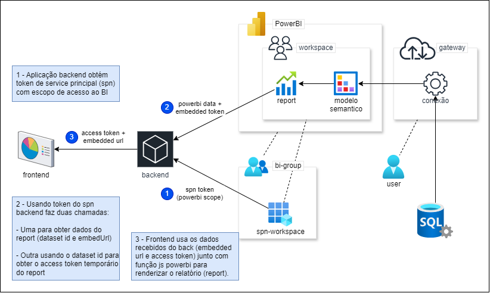

# Power BI

Poc de exemplo para gerar token de acesso para embedar um workspace do PowerBI.

## Arquitetura



## Estrutura no Azure

Para acesso ao Power BI, é necessário ter um grupo de usuários configurado na conta do Power BI, para isso, clique em configurações e em seguida em "Portal de Administração".

No portal de administração, na aba "Configurações de Locatário", procure por "Configurações do Desenvolvedor", nessa guia, procure por "Os principais serviços podem chamar as APIs públicas do Fabric".

A configuração nessa aba deve estar em "Habilitada" e no campo "Aplicar a:" deve ser selecionado o grupo de usuários ao qual o service principal deve fazer parte.

Com a configuração do Power BI aplicada ao grupo, crie um service principal, selecionando o primeiro radiobutton "Accounts in this organizational directory only...".

Assim que o service principal for criado, atribua as permissões de API:

- Power BI Service - Delegated permissions - Dataset.Read.All
- Power BI Service - Delegated permissions - Report.Read.All
- Power BI Service - Delegated permissions - Workspace.Read.All

Com o service principal criado e configurado, acesse o painel do Entra ID e vá em grupos, escolhendo o grupo de usuários que foi selecionado nas configurações do Power BI.

No grupo de usuários vá no menu "Manage > Members" e clique no botão "Add Member" na toolbox superior.

Adicione o service principal criado ao grupo de usuários.

Com o service principal adicionado no grupo, ao acessar o workspace no Power BI, no canto superior direito, clique em "Gerenciar Acesso".

Adicione o service principal como Visualizador.

## Estrutura do projeto

Há duas pastas principais onde estão as partes de frontend e backend que devem ser observadas:

- `public` - Pasta onde fica o exemplo de frontend. No index.js é feita a chamada para o backend (`GET /token`) e utiliza-se a biblioteca powerbi para renerização do relatório.
- `src` - Pasta onde fica o exemplo de backend. No service.js tem a estrutura de requisições para gerar o token de acesso ao relatório que será embedado.

## Run

Renomeie o arquivo `.env.example` para `.env` e preencha as variáveis.

Instale os pacotes e rode o exemplo através dos comandos a seguir.

```bash
# Instala os pacotes usados
npm install
# Inicia a aplicação front e back
npm run start
```

Caso esteja trabalhando em alterações, rode usando o nodemon que identifica alterações no código e atualiza o servidor.

```bash
# Inicia usando nodemon
npm run dev
```

## Docker

Caso queira rodar em container, use os comandos a seguir.

```bash
# Cria a imagem do projeto
docker build --rm -f Dockerfile-js -t powerbi:latest .
# Executa um container com a imagem criada
docker run --name powerbi --rm -p 8000:8000 -d powerbi:latest
```

## PHP

Para este exemplo também foi criada uma versão php, que roda em container Docker.

Para rodar a versão php, use os comandos a seguir.

```bash
# Cria a imagem do projeto
docker build --rm -f Dockerfile-php -t powerbi:latest .
# Executa um container com a imagem criada
docker run --name powerbi --rm -p 8000:8000 -d powerbi:latest

```

Para executar um container fazendo o mapeamento do volume com as pastas locais, use o comando:

```bash
docker run --name powerbi \
  -v $(pwd)/app:/var/www/html \
  -v $(pwd)/public:/var/www/html/public \
  --rm -p 8000:8000 -d powerbi:latest
```

\* _Obs: O parâmetro `--rm` em build é usado para remover versões prévias não usadas dessa imagem, no run é usado para remover o container quando parar de rodar._
